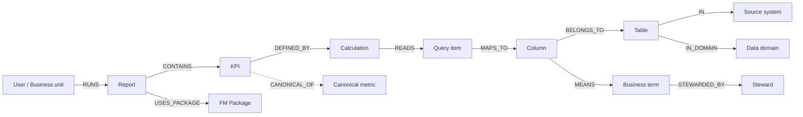
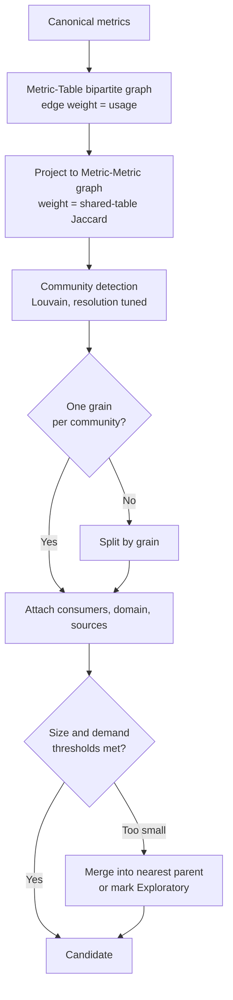
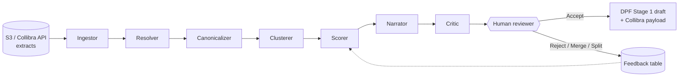

# Data Product Recommendation Engine — Specification

As of 17 September 2026

## 1. Executive summary

The Recommendation Engine converts report-level KPI lineage and Collibra metadata into a ranked, evidence-backed backlog of data product candidates. Each candidate is named by the decision it serves, the reports it would retire and the metric conflicts it resolves. Humans approve; the engine only proposes.

**The problem.** A report-centric BI estate produces one KPI per report, so the same KPI is computed many ways with no agreed answer. Rationalization removes reports but does not create the reusable, governed asset that replaces them. Without that asset, the retired reports get rebuilt in Power BI within a year.

**What the engine does.**

1. Ingests the Cognos rationalization report, the KPI lineage report and Collibra metadata into one resolved knowledge graph (KPI → Report → Package → Table → Column → Business Term).
2. Canonicalizes KPIs: groups equivalent calculations, flags variants and conflicts, so every candidate starts from "one metric, one answer".
3. Clusters canonical metrics into candidates by shared grain, shared source tables and shared consumers, then classifies each by archetype and tier.
4. Scores candidates on demand, consolidation, feasibility and risk, with every score traceable to cited evidence.
5. Emits seeds for the Data Product Factory: decision-register entries (Stage 1), charter draft (Stage 2), attribute register (Stage 5) and semantic-model skeleton (Stage 6).

**What we are not saying.**

- Not that usage equals value. Run counts are a demand proxy; a candidate cannot leave "Exploratory" status until a named consumer and a blocked decision are recorded by a human.
- Not that the engine designs the product. It proposes grain, attributes and metrics; the DPF stages and their gates own the design.
- Not that Cognos calculations are the truth. Conflicting variants are surfaced for a steward to adjudicate, never auto-resolved.
- Not text-to-SQL. The conversational surface queries the engine's own governed output tables through a semantic view, never raw lineage or warehouse tables.

## 2. Objectives, scope and non-goals

The engine exists to make the move from reports to self-serve data products evidence-driven rather than opinion-driven. Its four measurable objectives:

| # | Objective | Measure |
| --- | --- | --- |
| O1 | Identify the smallest set of data products that covers the most-used KPIs | % of usage-weighted KPI consumption covered by the top N candidates |
| O2 | Expose metric conflicts before they are re-implemented | Count of canonical metrics with ≥2 conflicting variants, each with a named steward |
| O3 | Quantify retirement impact per candidate | Reports retirable, users affected, packages decommissioned |
| O4 | Cut Stage 1–2 authoring effort in the DPF | Hours from candidate acceptance to approved charter, baseline vs engine-seeded |

**In scope**

- Batch ingestion of the three inputs as files or Collibra API extracts; no live Cognos connection required.
- KPI canonicalization, candidate generation, archetype/tier classification, scoring and ranking.
- Explainable recommendations with evidence citations back to report, package, table and business term.
- Review workflow (accept, reject, merge, split, defer) and a feedback loop that re-tunes weights.
- Seed artifacts for DPF Stages 1, 2, 5 and 6, plus a Collibra-ready candidate registration payload.
- A conversational surface over the engine's own output tables.

**Out of scope**

- Building, certifying or publishing the data product itself (DPF Stages 3–12).
- Report migration or Power BI conversion; the engine informs the rationalization disposition, it does not execute it.
- Consumer interviews. The engine drafts decision-register entries from usage patterns; a human validates them with the named consumer.
- Any write-back to Collibra without steward approval. Collibra remains the system of record; the engine produces proposals for it.
- Non-Cognos BI tools in the first release. The graph model is tool-agnostic, so a Power BI lineage extract can be added as a second adapter.

## 3. Inputs

Three inputs, each landed as-is into a `RAW` schema and validated before anything downstream runs. Required fields gate ingestion; optional fields improve scores but their absence is recorded as a feasibility gap, not a failure.

### 3.1 Cognos rationalization report

| Field | Required | Used for |
| --- | --- | --- |
| report_id, report_name, folder_path | Yes | Report node identity |
| fm_package | Yes | Report → Package edge |
| owner, business_unit | Yes | Consumer attribution, steward candidates |
| run_count_90d, run_count_12m | Yes | Demand weight |
| distinct_users_12m | Yes | Consumer breadth |
| last_run_date | Yes | Recency decay |
| schedule_flag, schedule_frequency | Optional | Cadence in decision-register seed |
| disposition (Keep / Merge / Retire / Migrate) | Yes | Retirement impact; "Keep" reports weigh higher |
| redundancy_cluster_id | Optional | Prior evidence of duplication |
| complexity_score | Optional | Feasibility (complex prompts and bursting suggest bespoke logic) |

### 3.2 KPI lineage report

| Field | Required | Used for |
| --- | --- | --- |
| kpi_id, kpi_label | Yes | KPI node identity; label feeds name similarity |
| report_id | Yes | KPI → Report edge |
| fm_package, query_subject, query_item | Yes | KPI → Package → Query item edges |
| calculation_expression | Yes | Parsed to an AST; fingerprint for canonicalization |
| aggregation_type | Yes | Fingerprint component (SUM, AVG, COUNT DISTINCT, ratio) |
| filter_expression | Optional | Variant detection (same measure, different filter) |
| source_system, database, schema, table, column | Yes | KPI → Column edges; join key to Collibra |
| usage_rank / cross_report_count | Optional | Cross-checked against the derived reuse count |

### 3.3 Collibra metadata and lineage

| Field | Required | Used for |
| --- | --- | --- |
| system, database, schema, table, column (full name) | Yes | Physical node identity; join key to lineage |
| business_term, definition | Optional | Attribute definitions in the Stage 5 seed; semantic similarity |
| data_domain, sub_domain | Yes | Domain cohesion feature; candidate domain assignment |
| data_owner, data_steward | Yes | Owner and steward candidates |
| classification / sensitivity, PII flag | Yes | Risk score; Stage 9 preview |
| data_type, nullable, primary_key, foreign_key | Optional | Grain inference; attribute register seed |
| system_of_record flag | Optional | Feasibility; prefer SoR sources |
| certification_status, quality_score | Optional | Trust signal carried into the candidate |
| lineage edges (table → table, column → column) | Optional | Extends KPI lineage upstream of the reporting database |

**Validation on load.** Row counts reconciled to the source extract. Every lineage row must resolve to a Collibra column; unresolved rows are quarantined with a reason code and counted in the feasibility score. Extract dates are stamped on every row so recommendations carry an as-of date.

## 4. Canonical knowledge graph

All three inputs resolve into one property graph, stored as Snowflake node and edge tables. The graph is the only thing the recommender reads; nothing downstream touches the raw extracts.



Reading left to right: consumption (who runs what) → reporting logic (KPI and calculation) → physical lineage → business meaning. The dotted edge is produced by the engine in section 5; every other edge comes from an input.

### 4.1 Node types

| Node | Source | Key properties |
| --- | --- | --- |
| Report | Rationalization | run_count_12m, distinct_users, last_run, disposition, complexity |
| KPI | Lineage | label, aggregation, filter_expr, expression_ast, fingerprint |
| Calculation | Lineage (parsed) | normalized expression, operand columns, arithmetic shape |
| FM Package | Lineage | name, query subjects, report count |
| Query item | Lineage | package, query subject, item name |
| Column | Collibra | full name, data_type, pk/fk, sensitivity, pii_flag |
| Table | Collibra | full name, sor_flag, row_count if profiled, grain (inferred) |
| Source system | Collibra | name, lifecycle status (active / sunset) |
| Business term | Collibra | definition, domain, certification status |
| Data domain | Collibra | name, owner |
| Steward / Owner | Collibra + rationalization | role, domain |
| User / Business unit | Rationalization | unit, report count |
| Canonical metric | Engine | canonical name, variants, conflict flag, steward |

### 4.2 Entity resolution rules

The hard join is Cognos query item → Collibra column. Rules run in order; the first match wins and its confidence is stored on the edge.

| Rule | Method | Confidence |
| --- | --- | --- |
| ER-1 | Exact match on system.database.schema.table.column after case and quote normalization | 1.00 |
| ER-2 | Exact table match + column match after alias expansion (FM query-item alias → underlying column from package metadata) | 0.95 |
| ER-3 | Collibra lineage says the reporting-DB column derives from one upstream column; inherit that edge | 0.90 |
| ER-4 | Table match + column name similarity ≥ 0.92 (Jaro-Winkler on tokenized names, e.g. `cust_acct_no` ~ `customer_account_number`) | 0.80 |
| ER-5 | Business-term match: query-item label equals a Collibra term whose column is in the same table | 0.70 |
| ER-6 | Embedding similarity of label + definition text (Cortex `EMBED_TEXT_768`) ≥ 0.85, same domain | 0.60 |
| Unresolved | Quarantined with reason code; counted against feasibility | — |

Edges below 0.80 confidence are shown to the reviewer as "probable" and are never used to claim a KPI conflict. Report owner strings are matched to Collibra stewards by identity provider ID where available, else by normalized name with a manual confirmation flag.

### 4.3 Grain inference

Each table is assigned a grain from Collibra primary keys, mapped to the conformed backbone (Customer → Account → Premise → Service Point → Meter) or to a domain-specific entity when no backbone match exists. A KPI inherits the grain of its fact table; multi-table KPIs take the finest grain among their measures. Grain is the primary constraint on candidate generation.

## 5. KPI canonicalization

Canonicalization collapses the KPIs found across reports into a smaller set of canonical metrics, each with its variants and conflicts recorded. Deterministic matching runs first; language models only name and describe, never decide equivalence.

### 5.1 Pipeline

1. **Parse.** Each `calculation_expression` is parsed into an AST (Cognos report expression grammar; unparseable expressions are flagged `PARSE_FAIL` and handled as opaque).
2. **Normalize.** Resolve query items to Collibra columns via section 4.2; expand aliases; order commutative operands; strip formatting functions (`round`, `cast`, currency).
3. **Fingerprint.** `fingerprint = SHA-256(aggregation + sorted operand columns + arithmetic shape)`. Filters are fingerprinted separately as `filter_fp`.
4. **Group.** KPIs with equal `fingerprint` and `filter_fp` are the same metric. Equal `fingerprint`, different `filter_fp` are variants. Same or similar label, different `fingerprint` are conflicts.
5. **Name and describe.** For each group, Cortex `AI_COMPLETE` proposes a canonical `snake_case` name and one-sentence definition from the labels, expressions and Collibra terms. Marked `AI_DRAFT` until a steward accepts.
6. **Assign steward.** The steward of the fact table's business term, else the most frequent report owner in the group, else unassigned (a gap).

### 5.2 Match tiers

| Tier | Condition | Outcome |
| --- | --- | --- |
| Identical | Same fingerprint, same filter_fp | Merged into one canonical metric |
| Variant | Same fingerprint, different filter_fp | One canonical metric; each filter becomes a named dimension or a documented variant |
| Nominal conflict | Label similarity ≥ 0.90 (embedding) but different fingerprint | Conflict record; steward must pick the authoritative definition or rename |
| Structural cousin | Same operand columns, different aggregation | Separate metrics, cross-linked (e.g. total vs average of the same measure) |
| Opaque | PARSE_FAIL | Kept as its own metric, feasibility penalty, listed for manual definition |

### 5.3 Conflict register

Every nominal conflict produces a row with the competing expressions, the reports using each, their usage weight, and the difference in operand columns or filters. The register is the first artifact a domain steward sees, because unresolved conflicts are the reason two teams will never trust the same number.

### 5.4 Typical conflict patterns the engine should expect

- Same measure, different exclusions (with vs without inactive accounts, with vs without major-event days).
- Same measure, different time basis (calendar vs fiscal month, bill date vs read date).
- Same label, different denominator (per account vs per premise vs per service point).
- Hard-coded thresholds inside the expression (`> 60` days) that differ by report.
- Null handling that silently changes the result (`COALESCE` in one report, not in another).

Each pattern maps to a Stage 6 semantic-model decision: a filter dimension, a time grain, an explicit grain declaration, a parameterized threshold, or a documented null rule.

## 6. Candidate generation

A candidate is a set of canonical metrics that share one evaluation grain, draw on an overlapping set of source tables, and serve an identifiable group of consumers. Generation is graph clustering under a grain constraint, not a rules list per domain.



Communities form around shared fact tables; the grain check splits any community that mixes, say, account-level and meter-level measures. Small communities are not discarded; they become Exploratory candidates or dimensions of a larger one.

### 6.1 Steps and parameters

| Step | Rule | Default parameter |
| --- | --- | --- |
| Bipartite build | Edge metric→table for every operand column; weight = usage-weighted report count of the metric | — |
| Projection | Metric–metric similarity = Jaccard of source table sets, plus 0.2 bonus if same Collibra domain | min similarity 0.25 |
| Community detection | Louvain on the projected graph; resolution controls cluster size | resolution 1.0, re-run at 0.7 and 1.3 for reviewer comparison |
| Grain split | If a community spans >1 inferred grain, split by grain; parent link kept | — |
| Consumer attach | Users and business units of all reports using the community's metrics | — |
| Size floor | Communities with <3 metrics or <2 distinct business units | Below floor → Exploratory |
| Naming | Cortex proposes name from the dominant domain, grain and top metrics; marked AI_DRAFT | — |

### 6.2 Second-pass seeding from the consumption side

Clustering on lineage alone finds source-aligned products. Consumer-aligned products appear when the same business unit runs reports across several communities; the engine records these as composite candidates ("Collections manager view" spanning arrears, payments and disconnects). Composites are tagged Tier = consumer-aligned and depend on the underlying candidates.

### 6.3 Entity master detection

A table referenced by metrics in ≥3 communities, with a Collibra primary key on a backbone entity, becomes an Entity Master candidate (e.g. Account, Premise, Meter). Entity masters are ranked separately because their value is reuse, not usage.

### 6.4 What is deliberately not a candidate

- A single report, however heavily used. Its metrics join a community or become Exploratory.
- A metric with no resolved lineage (all edges quarantined). It is listed as a data gap.
- A community whose only sources are a sunset system with no successor mapped in Collibra. It is listed under risks with the sunset date.

## 7. Archetype and tier classification

Each candidate receives one archetype and one tier from graph features alone, so the DPF Stage 2 charter opens pre-filled and the reviewer only confirms or overrides.

### 7.1 Archetype rules (evaluated in order; first match wins)

| Archetype | Rule | Signal from the graph |
| --- | --- | --- |
| Entity Master | Hub table with backbone PK, referenced by ≥3 communities, metrics mostly COUNT DISTINCT or attributes | High in-degree table, few aggregations |
| Reference Data | Small table (<10K rows if profiled), no measures, used only as a filter or lookup | Only appears in filter_fp, never as an operand |
| Event Stream | Fact table with timestamp grain finer than day, metrics are counts and durations over event rows | Grain = event, time column in every filter |
| Metric / KPI | Community of ≥3 canonical metrics over one or two fact tables at a business grain | Default for aggregation-heavy communities |
| Feature Store | Metrics used as inputs to a scoring or model report, or Collibra tags a term as model feature | Downstream report tagged predictive; term tag |
| Insight / Recommendation | Metrics whose expression contains ranking, thresholds and status derivation | CASE-heavy AST, rank functions |

### 7.2 Tier rules

| Tier | Rule |
| --- | --- |
| Source-aligned | All operand columns come from one source system; no cross-system joins in any metric |
| Aggregate | Metrics join ≥2 source systems or roll a source-aligned candidate to a coarser grain |
| Consumer-aligned | Composite candidate from section 6.2, or a community whose consumers are one business unit and whose metrics span ≥2 other candidates |

### 7.3 Confidence

Classification confidence is the margin between the winning rule's score and the runner-up. Below 0.6 the archetype is shown as a choice between the top two, not a single answer. Overrides by reviewers are logged and used to tune rule thresholds in the feedback loop (section 13).

## 8. Scoring model

Candidates are ranked on four dimensions scored 0–100, combined into a composite, and constrained by hard gates that no weight can override. Every score exposes its features and the graph rows behind them.

### 8.1 Dimensions and features

| Dimension | Feature | Definition | Weight in dimension |
| --- | --- | --- | --- |
| Demand | Usage weight | Σ over reports of `ln(1 + run_count_12m) × distinct_users × recency_decay`, recency = `0.5^(months_since_last_run / 6)` | 0.50 |
| Demand | Consumer breadth | Distinct business units using the candidate's metrics, log-scaled | 0.30 |
| Demand | Cadence | Share of scheduled reports (a scheduled report implies a recurring decision) | 0.20 |
| Consolidation | Reports retirable | Reports whose every KPI is covered by the candidate, weighted by disposition (Retire 1.0, Merge 0.8, Keep 0.5, Migrate 0.3) | 0.50 |
| Consolidation | Variants collapsed | Count of KPI rows merged into canonical metrics | 0.30 |
| Consolidation | Conflicts surfaced | Nominal conflicts resolved by the candidate's metric definitions | 0.20 |
| Feasibility | Lineage completeness | Share of operand columns resolved at ≥0.80 confidence | 0.35 |
| Feasibility | Definition coverage | Share of operand columns with a Collibra business term and definition | 0.25 |
| Feasibility | Source health | 1.0 if all sources are system-of-record and active; 0.5 if non-SoR; 0 if any source is sunset without successor | 0.25 |
| Feasibility | Calculation determinism | Share of metrics parsed (not opaque), no report-level prompts embedded | 0.15 |
| Risk | Sensitivity | Max sensitivity class across operand columns; PII present raises Stage 9 effort | 0.40 |
| Risk | Grain ambiguity | 1 minus the share of metrics whose grain matched the candidate grain without a split | 0.30 |
| Risk | Conflict load | Unresolved conflicts per metric; more conflicts means longer steward adjudication | 0.30 |

### 8.2 Composite

`composite = 0.35 × Demand + 0.30 × Consolidation + 0.25 × Feasibility − 0.10 × Risk`

Weights are stored in a config table, versioned, and re-estimated from reviewer decisions (section 13). The initial weights favour products that retire the most reports for the least build risk, which is the rationalization business case.

### 8.3 Hard gates (applied after scoring; a failed gate caps status, it does not adjust the number)

| Gate | Condition | Effect |
| --- | --- | --- |
| G1 Named consumer | No business unit with ≥2 users, or reviewer has not confirmed a consumer | Status capped at Exploratory |
| G2 Lineage floor | Lineage completeness < 0.60 | Status capped at Exploratory; listed as a Collibra gap |
| G3 Single grain | Grain ambiguity > 0.30 | Must be split before Proposed |
| G4 Sunset source | Any source sunset with no successor | Status = Blocked, with sunset date |

### 8.4 Explainability contract

Each candidate's score record carries the feature values, the weight version, and a list of evidence IDs (report_id, kpi_id, column full name, business term). A reviewer can open any number and see the rows that produced it. Scores without evidence rows are invalid and are not published.

## 9. Recommendation output

Every recommendation is one candidate record plus its evidence, written to governed tables and rendered as a review card. The record is complete enough to open a DPF data product at Stage 1 with the first two stages pre-drafted.

### 9.1 The candidate record

| Field | Content | Origin |
| --- | --- | --- |
| candidate_id, proposed_name, one-line purpose | Name and purpose in consumption terms ("Arrears and collections position by account") | Cortex draft, AI_DRAFT flag |
| archetype, tier, confidence | Section 7 output | Rules |
| domain, sub_domain | Dominant Collibra domain of source tables | Collibra |
| grain | Backbone entity or domain entity | Section 4.3 |
| owner_candidate, steward_candidate | Collibra owner of the dominant domain; steward of the fact table's term | Collibra + report owners |
| consumers | Business units, user counts, top reports, cadence | Rationalization |
| decisions_drafted | One decision-register entry per business unit: what they run, how often, inferred decision | Engine draft from usage; must be confirmed |
| canonical_metrics | Name, definition, expression, variants, conflict flag, steward | Section 5 |
| conflict_register | Competing definitions with usage weight and difference | Section 5.3 |
| attributes | Operand and filter columns with Collibra definition, type, sensitivity, steward | Collibra |
| sources | Tables, systems, SoR flag, lifecycle status | Collibra |
| reports_retirable | Report IDs, disposition, users, last run | Rationalization |
| scores | Four dimensions, composite, weight version, gate results | Section 8 |
| evidence | Row-level IDs behind every number | Graph |
| gaps | Unresolved lineage, missing definitions, missing stewards, opaque calculations | Engine |
| status | Exploratory / Proposed / Accepted / Rejected / Merged / Deferred | Reviewer |

### 9.2 Seeds for the Data Product Factory

| DPF stage | Seed artifact | What is pre-filled | What the human must add |
| --- | --- | --- | --- |
| 1 Consumption Discovery | `decision-register.yaml` | Consumer persona (business unit + role from report owner), cadence, questions (report titles and KPI labels rephrased) | The blocked decision, latency tolerance, consequence of not deciding |
| 2 Charter | Charter draft | Archetype, tier, scope (metrics in), out-of-scope (metrics split off), value hypothesis (reports retired, conflicts resolved) | Success measures, sign-off |
| 3 Source Discovery | Source inventory | Tables, systems, SoR designation, gap log from unresolved lineage | Profiling stats |
| 5 Attribute Register | Excel register | Attribute name, definition, lineage, type, nullability, sensitivity, steward | Allowed values, derivation review, sign-off |
| 6 Semantic Model | `semantic-model.yaml` skeleton | Entities, dimensions from filter variants, metrics with expressions and Stage 1 question links | Join validation, metric certification |
| 12 Operate | Retirement list | Reports to retire on publication, with owners to notify | Notification and cut-over dates |

### 9.3 Collibra registration payload

For each Accepted candidate, a JSON payload conforming to the catalog's data product asset type: name, domain, owner, steward, status = Proposed, linked business terms, linked tables, linked reports. Loaded by a steward through the catalog's import, never pushed by the engine directly.

### 9.4 Portfolio views

Alongside individual records, the engine publishes three roll-ups: coverage curve (cumulative usage covered by top N candidates), retirement map (reports by candidate by disposition), and conflict heat map (canonical metrics by number of competing definitions and usage at stake).

## 10. Agent architecture

The engine runs inside Snowflake as a pipeline of six chartered agents with one human gate. Deterministic SQL and graph steps do the matching, clustering and scoring; Cortex is used for naming, definitions, similarity and the conversational surface. No agent can change a candidate's status past Proposed.



Each agent writes only to its own output tables and stamps a run ID, so any recommendation can be replayed from the extracts that produced it.

### 10.1 Agent roles

| Agent | Responsibility | Mechanism | Writes to |
| --- | --- | --- | --- |
| Ingestor | Land extracts, validate schema, reconcile counts, stamp as-of | Snowpipe / COPY, Zod-style schema checks in a stored procedure | RAW.*, INGEST_LOG |
| Resolver | Build node and edge tables; run ER-1…ER-6; quarantine unresolved | SQL + `EMBED_TEXT_768` + `VECTOR_COSINE_SIMILARITY` | GRAPH.NODE_*, GRAPH.EDGE_*, ER_QUARANTINE |
| Canonicalizer | Parse expressions, fingerprint, group, draft names | Python UDF parser, SHA-256, `AI_COMPLETE` for names (AI_DRAFT) | KPI_CANONICAL, KPI_VARIANT, KPI_CONFLICT |
| Clusterer | Bipartite projection, Louvain, grain split, composites, entity masters | Snowpark Python (networkx / igraph) | DP_CANDIDATE, DP_CANDIDATE_METRIC, DP_CANDIDATE_SOURCE |
| Scorer | Compute features, dimensions, composite, gates | SQL over graph tables; weights from SCORE_WEIGHT (versioned) | DP_CANDIDATE_SCORE, DP_CANDIDATE_EVIDENCE |
| Narrator | Purpose statement, decision-register drafts, charter draft, seed files | `AI_COMPLETE` with the candidate record as the only context; outputs marked AI_DRAFT | DP_CANDIDATE_NARRATIVE, seed YAML/JSON/XLSX to stage |
| Critic | Check each candidate against the hard gates and the DPF Stage 1–2 exit criteria; list what a reviewer will reject | Rule checks + `AI_COMPLETE` critique against the criteria text | DP_CANDIDATE_CRITIQUE |

### 10.2 Human review gate

Candidates arrive in Proposed (or Exploratory if a gate capped them). The reviewer, a domain data product owner or the council for the domain, can Accept, Reject, Merge into another candidate, Split by grain or consumer, or Defer with a reason. Accept creates the DPF data product and attaches the seeds; the DPF gate then governs from there. Every decision writes to the feedback table with the reviewer, timestamp, reason code and, for overrides, the field changed.

### 10.3 Conversational surface

A Cortex Agent is bound to a semantic view over `DP_CANDIDATE*`, `KPI_*` and `GRAPH.*` tables. It answers questions such as "which candidates retire the most Finance reports", "show the competing definitions of days sales outstanding", or "what would block the arrears candidate at Stage 9". The semantic view is the only object the agent can query; raw extracts and warehouse tables are not exposed, consistent with the no-free-form-text-to-SQL rule. Answers cite candidate and evidence IDs.

### 10.4 Run cadence

Full re-run on each new rationalization or Collibra extract; incremental re-score when a reviewer decision changes weights. A run is ~minutes at tens of thousands of reports because clustering operates on canonical metrics (hundreds to low thousands), not on reports.

## 11. Output data model and reference SQL

Three schemas: `RAW` (extracts as landed), `GRAPH` (resolved nodes and edges), `RECO` (canonical metrics, candidates, scores, evidence, feedback). Everything in `RECO` carries `run_id` and `as_of_date`; nothing is updated in place.

### 11.1 Tables

| Schema.Table | Grain | Key columns |
| --- | --- | --- |
| GRAPH.NODE_REPORT | Report | report_id, name, package, owner, business_unit, run_count_12m, distinct_users, last_run, disposition |
| GRAPH.NODE_KPI | KPI in a report | kpi_id, report_id, label, aggregation, expression, expression_ast, fingerprint, filter_fp, parse_status |
| GRAPH.NODE_COLUMN | Physical column | column_fqn, table_fqn, system, data_type, pk_flag, sensitivity, pii_flag, business_term_id, steward_id |
| GRAPH.NODE_TABLE | Physical table | table_fqn, system, sor_flag, lifecycle_status, inferred_grain, domain |
| GRAPH.EDGE_KPI_COLUMN | KPI → Column | kpi_id, column_fqn, role (operand / filter), er_rule, confidence |
| GRAPH.ER_QUARANTINE | Unresolved lineage row | kpi_id, raw_reference, reason_code |
| RECO.KPI_CANONICAL | Canonical metric | metric_id, canonical_name, definition, fingerprint, grain, steward_id, name_status (AI_DRAFT / ACCEPTED) |
| RECO.KPI_VARIANT | KPI → canonical metric | kpi_id, metric_id, tier (IDENTICAL / VARIANT / COUSIN), filter_fp |
| RECO.KPI_CONFLICT | Competing definitions | conflict_id, label, metric_id_a, metric_id_b, usage_weight_a, usage_weight_b, difference_summary, resolution_status |
| RECO.DP_CANDIDATE | Candidate | candidate_id, run_id, proposed_name, purpose, archetype, tier, grain, domain, owner_candidate, steward_candidate, status |
| RECO.DP_CANDIDATE_METRIC | Candidate → metric | candidate_id, metric_id |
| RECO.DP_CANDIDATE_SOURCE | Candidate → table | candidate_id, table_fqn, share_of_metrics |
| RECO.DP_CANDIDATE_CONSUMER | Candidate → business unit | candidate_id, business_unit, users, report_count, scheduled_share |
| RECO.DP_CANDIDATE_REPORT | Candidate → retirable report | candidate_id, report_id, coverage (1.0 = all KPIs covered), disposition |
| RECO.DP_CANDIDATE_SCORE | Candidate score | candidate_id, weight_version, demand, consolidation, feasibility, risk, composite, gate_results |
| RECO.DP_CANDIDATE_EVIDENCE | Score feature → row | candidate_id, feature, evidence_type, evidence_id |
| RECO.DP_CANDIDATE_CRITIQUE | Critic finding | candidate_id, criterion, finding, severity |
| RECO.REVIEW_DECISION | Reviewer action | candidate_id, decision, reason_code, reviewer, decided_at, field_overridden |
| RECO.SCORE_WEIGHT | Weight config | weight_version, dimension, feature, weight, effective_from |

### 11.2 Reference SQL

Usage-weighted demand per canonical metric:

```sql
CREATE OR REPLACE VIEW RECO.V_METRIC_DEMAND AS
SELECT v.metric_id,
       SUM( LN(1 + r.run_count_12m) * r.distinct_users
            * POWER(0.5, DATEDIFF('month', r.last_run, CURRENT_DATE()) / 6.0) ) AS usage_weight,
       COUNT(DISTINCT r.business_unit)                                          AS consumer_breadth,
       COUNT(DISTINCT r.report_id)                                              AS report_count
FROM RECO.KPI_VARIANT v
JOIN GRAPH.NODE_KPI k    ON k.kpi_id = v.kpi_id
JOIN GRAPH.NODE_REPORT r ON r.report_id = k.report_id
GROUP BY v.metric_id;
```

Source-table affinity between canonical metrics (input to clustering):

```sql
CREATE OR REPLACE VIEW RECO.V_METRIC_AFFINITY AS
WITH mt AS (
  SELECT DISTINCT v.metric_id, c.table_fqn
  FROM RECO.KPI_VARIANT v
  JOIN GRAPH.EDGE_KPI_COLUMN e ON e.kpi_id = v.kpi_id AND e.role = 'operand' AND e.confidence >= 0.80
  JOIN GRAPH.NODE_COLUMN c    ON c.column_fqn = e.column_fqn
),
sz AS (SELECT metric_id, COUNT(*) AS n FROM mt GROUP BY metric_id)
SELECT a.metric_id AS metric_a, b.metric_id AS metric_b,
       COUNT(*) / (sa.n + sb.n - COUNT(*))::FLOAT AS jaccard
FROM mt a JOIN mt b ON a.table_fqn = b.table_fqn AND a.metric_id < b.metric_id
JOIN sz sa ON sa.metric_id = a.metric_id
JOIN sz sb ON sb.metric_id = b.metric_id
GROUP BY a.metric_id, b.metric_id, sa.n, sb.n
HAVING jaccard >= 0.25;
```

Reports fully covered by a candidate (retirement impact):

```sql
CREATE OR REPLACE VIEW RECO.V_CANDIDATE_REPORT_COVERAGE AS
WITH rk AS (
  SELECT k.report_id, v.metric_id
  FROM GRAPH.NODE_KPI k JOIN RECO.KPI_VARIANT v ON v.kpi_id = k.kpi_id
),
cov AS (
  SELECT cm.candidate_id, rk.report_id,
         COUNT(DISTINCT rk.metric_id)                                            AS report_metrics,
         COUNT(DISTINCT CASE WHEN cm.metric_id IS NOT NULL THEN rk.metric_id END) AS covered_metrics
  FROM rk
  LEFT JOIN RECO.DP_CANDIDATE_METRIC cm ON cm.metric_id = rk.metric_id
  GROUP BY cm.candidate_id, rk.report_id
)
SELECT candidate_id, report_id,
       covered_metrics / report_metrics::FLOAT AS coverage
FROM cov
WHERE candidate_id IS NOT NULL;
```

Null rule: every feature resolves to a number, never NULL. Missing inputs COALESCE to the value that lowers the score, so a metadata gap can never make a candidate look better than the evidence supports.

## 12. Worked example: arrears and collections

Illustrative figures; the shape is what matters. A utility's collections KPIs are a typical case because dozens of Cognos reports compute arrears slightly differently and nobody owns the number.

### 12.1 What the engine finds

| Step | Result |
| --- | --- |
| Lineage input | 47 reports, 212 KPI rows, all on CIS billing and payment tables |
| Canonicalization | 212 KPI rows → 14 canonical metrics; 9 with variants, 3 nominal conflicts |
| Top conflict | "Arrears 60+" in 11 reports: 6 use `days_past_due > 60`, 4 use `>= 61`, 1 excludes budget-billing accounts; usage at stake 38% of the community |
| Community | One community at grain = Account; 3 KPIs at Premise (disconnects) split into a linked child |
| Consumers | Credit & Collections (22 users, 31 reports, mostly scheduled weekly), Finance (9 users, 12 reports, monthly), Customer Operations (6 users, 4 reports) |
| Sources | CIS billing, CIS payment, CIS payment-arrangement tables; all SoR, active |
| Archetype / tier | Metric/KPI, aggregate (two CIS modules); confidence 0.82 |
| Gates | G1 passed (3 business units); G2 lineage completeness 0.91; G3 grain ambiguity 0.14 after split; G4 clear |
| Scores | Demand 84, Consolidation 79, Feasibility 88, Risk 42 (PII in account attributes, 3 conflicts) → composite 76 |
| Retirement | 39 of 47 reports fully covered (coverage = 1.0); 8 partially covered pending the Premise child |

### 12.2 The candidate card, as a reviewer sees it

- **Proposed name:** Arrears and collections position by account (AI_DRAFT)
- **Purpose:** Give Credit & Collections and Finance one agreed arrears number by aging bucket, payment arrangement status and OpCo, refreshed daily.
- **Grain:** Account. **Domain:** Customer / Billing & Collections.
- **Metrics (14):** `arrears_balance`, `arrears_balance_by_aging_bucket`, `accounts_in_arrears`, `days_sales_outstanding`, `payment_arrangement_rate`, `arrangement_default_rate`, `write_off_amount`, `collection_effectiveness_index`, and six more.
- **Conflicts to adjudicate (3):** aging boundary (`> 60` vs `>= 61`); budget-billing exclusion; DSO denominator (billed revenue vs total revenue).
- **Decision-register draft:** Credit & Collections runs the weekly aging report every Monday; inferred decision "which accounts enter the dunning cycle this week". Reviewer to confirm or rewrite.
- **Gaps (2):** `write_off_reason_code` has no Collibra definition; steward for payment-arrangement terms unassigned.

### 12.3 What changes downstream

The aging-boundary conflict becomes a parameterized threshold in the Stage 6 semantic model, not a hard-coded number. The budget-billing exclusion becomes a filter dimension so both readings exist under one metric. The 39 fully covered reports go on the Stage 12 retirement list with their owners, and the Premise-grain child (disconnect notices, field collections) is registered as a dependent candidate that anchors to Service Point in the conformed backbone.

## 13. Guardrails, quality gates and feedback loop

The engine is propose-only, evidence-bound and replayable. These properties are enforced by structure, not by policy text.

### 13.1 Guardrails

| Guardrail | Enforcement |
| --- | --- |
| Propose-only | No agent has write access to `status` beyond Proposed; only `REVIEW_DECISION` rows written by an authenticated reviewer move it |
| AI outputs marked | Every Cortex-generated field carries `AI_DRAFT` until a human accepts it; unaccepted drafts never reach Collibra or the DPF |
| Evidence required | A score row without ≥1 evidence row fails a constraint check and is excluded from the run's publication |
| No raw access from the conversational surface | Cortex Agent bound to one semantic view; grants exist only on that view |
| Collibra remains the record | Engine writes proposals to a staging payload; a steward imports; no direct API write |
| Sensitivity carried, never dropped | Column sensitivity from Collibra propagates to attributes and to the candidate's risk score; PII columns are listed on the card |
| Replayability | Every run stores extract IDs, weight version and parser version; a run can be reproduced exactly |

### 13.2 Quality gates on a run (a failed gate stops publication of that run)

- Ingest reconciliation: row counts within 0.5% of the extract manifest.
- Resolution rate: ≥ 80% of lineage rows resolved at ≥ 0.80 confidence; below that the run publishes only the Collibra gap list.
- Parse rate: ≥ 70% of expressions parsed; below that canonicalization is degraded and flagged on every card.
- Coverage sanity: top 20 candidates must cover ≥ 50% of usage-weighted KPI consumption, else clustering resolution is re-tuned before publication.
- Stability: ≥ 85% of candidates from the previous run map to a candidate in this run (Jaccard on metric sets ≥ 0.6); large churn triggers a review before publication.

### 13.3 Feedback loop

Reviewer decisions are the training signal. Each Accept, Reject, Merge, Split or override is stored with a reason code, and three things are re-estimated monthly:

1. **Score weights.** Logistic regression of Accept vs Reject on the four dimensions produces a proposed weight vector; a data product council approves it before it becomes the new `weight_version`.
2. **Archetype thresholds.** Overrides of archetype or tier adjust rule margins; rules that are overridden more than 30% of the time are rewritten, not re-weighted.
3. **Clustering resolution.** Merge and Split decisions tune Louvain resolution per domain.

Weight changes never re-score Accepted candidates; they apply to the next run. A reviewer can always see which weight version scored the candidate in front of them.

## 14. Delivery phases and acceptance criteria

Three phases, each with an exit test that can fail. Phase 1 proves the graph and the canonicalization on one domain before any scoring is trusted.

| Phase | Duration | Scope | Exit criteria | Falsifier |
| --- | --- | --- | --- | --- |
| 1 Graph and canonicalization | 6 weeks | Ingest all three extracts; resolver; canonicalizer; conflict register for one domain | ≥ 80% lineage resolution; ≥ 70% parse rate; domain steward signs off the conflict register as correct for a 30-metric sample | If stewards reject > 20% of the canonical groupings in the sample, the fingerprint rules are wrong and Phase 2 does not start |
| 2 Candidates and review | 8 weeks | Clusterer, scorer, narrator, critic, review workflow, DPF seeds for Stages 1, 2, 5, 6 | Top 20 candidates cover ≥ 50% of usage-weighted consumption; 2 candidates Accepted and opened in the DPF with seeds; reviewers rate ≥ 70% of cards as "usable without rework" | If Accepted candidates need their metric set changed by > 40% at DPF Stage 2, clustering is producing the wrong boundaries |
| 3 Scale and conversation | 6 weeks | All domains; Collibra payload; conversational surface; feedback re-estimation; second BI adapter if in scope | Full-estate run in < 30 minutes; conversational answers cite evidence on 20 test questions; first weight re-estimation approved by the council | If reviewer decisions are too few (< 50) to re-estimate weights, the feedback loop is designed but unproven; say so |

### 14.1 Acceptance criteria for the engine

- Every recommendation is reproducible from stored extract IDs, weight version and parser version.
- No code path other than a reviewer's `REVIEW_DECISION` can move a candidate past Proposed (covered by a test).
- Every score row has evidence rows; a constraint test proves the inverse cannot be written.
- The conversational agent cannot query any object outside its semantic view (grant audit).
- AI-drafted names and definitions are visibly marked until accepted, in the card, the seeds and the Collibra payload.
- A Stage 1 decision register seeded by the engine passes the DPF's own exit criteria after a reviewer adds the blocked decision, with no other edits.
- The conflict register for the pilot domain is signed off by the steward.

### 14.2 Success measures at 90 days after Phase 2

| Measure | Target |
| --- | --- |
| Usage-weighted KPI consumption covered by Accepted candidates | ≥ 40% |
| Reports on a retirement list with a named owner | ≥ 500 |
| Canonical metrics with a confirmed steward | ≥ 80% of those in Accepted candidates |
| Hours from Accept to approved DPF charter | ≤ 50% of the pre-engine baseline |
| Conflicts adjudicated by stewards | ≥ 30 |

## 15. Risks, open decisions and assumptions

The three things most likely to bite are metadata quality in Collibra, Cognos expression parsing, and the temptation to treat usage as proof of value. Each has a named mitigation and an owner role.

### 15.1 Risks

| Risk | Likelihood | Impact | Mitigation | Owner |
| --- | --- | --- | --- | --- |
| Collibra column definitions are sparse or stale, so definition coverage and steward assignment are weak | High | High | Publish the gap list as a first-class output; Phase 1 includes a definition-backfill sprint for the pilot domain | Domain steward |
| Cognos expressions use report-level prompts, macros or embedded SQL that the parser cannot read | High | Medium | Opaque tier with feasibility penalty; manual definition queue; parser extended by observed failure classes | Engine team |
| Lineage report stops at the reporting database, not the true source | Medium | High | Collibra table-level lineage extends upstream (ER-3); where absent, source health scored as non-SoR | Engine team |
| Usage is read as value and low-run, high-consequence reports (regulatory filings) are under-ranked | Medium | High | G1 named-consumer gate; reviewer can mark a report "decision-critical", which floors its usage weight | Data product council |
| Reviewers accept AI-drafted names without reading them, and drift enters the semantic layer | Medium | Medium | AI_DRAFT flag blocks Collibra import; naming accepted separately from candidate acceptance | Domain steward |
| Community detection produces one giant cluster around a hub fact table | Medium | Medium | Resolution sweep at three settings; grain split; entity-master extraction removes hub tables from projection | Engine team |
| Report owner strings do not map to Collibra identities | High | Low | Manual mapping table for the top 200 owners by usage; rest flagged | Catalog admin |

### 15.2 Open decisions

| # | Decision | Why it matters | Proposed owner |
| --- | --- | --- | --- |
| D-01 | Usage window: 12 months or 24 months, and treatment of seasonal reports | Changes demand scores for annual and rate-case reports | Data product council |
| D-02 | Minimum community size before a candidate is Proposed rather than Exploratory | Controls backlog length and reviewer load | Data product council |
| D-03 | Whether "Keep" reports count toward consolidation at all | A Keep report replaced by a product is still a win; a Keep report unaffected is not | Rationalization lead |
| D-04 | Initial score weights and who approves changes | Determines the first ranking; must be visible and contestable | Data product council |
| D-05 | Whether Power BI lineage is a Phase 3 adapter or a separate programme | Estate is mixed; a single graph needs both | Programme sponsor |
| D-06 | Sensitivity threshold that forces Privacy review before Proposed | Aligns with DPF Stage 9 veto | Privacy officer |
| D-07 | Collibra asset type and attributes for a Proposed data product | Registration payload cannot be built without it | Catalog admin |
| D-08 | Which reviewer role can Accept per domain | Propose-only means nothing if acceptance is undefined | Programme sponsor |

### 15.3 Assumptions

- The lineage report is complete at KPI → column level for the reports in scope; partial coverage is treated as a gap, not inferred.
- Report usage statistics are available for at least 12 months from Cognos audit tables.
- Collibra exposes stewards, domains and sensitivity through its export or REST API in a form that can be landed to Snowflake.
- The Data Product Factory's Stage 1, 2, 5 and 6 schemas are stable enough to target for seeds; changes there require a seed-adapter change here.
- Cortex functions are available in the Snowflake account and approved for use on metadata (not customer data); no customer records are read by the engine.


## 16. Multi-tool BI adapters: Cognos and Power BI

The knowledge graph in section 4 is tool-agnostic. A BI tool enters the engine through an adapter that maps its own objects onto the same Report, KPI, Calculation and Query-item nodes, so a mixed Cognos and Power BI estate produces one candidate backlog rather than two.

### 16.1 Object mapping

| Graph node | Cognos | Power BI |
| --- | --- | --- |
| Report | Report / Active Report / Dashboard | Report (report_id, workspace) |
| Report container | Folder path, Framework Manager package | Workspace, App |
| Semantic container | FM Package | Semantic model (dataset) |
| KPI | Report-level calculation or query item used as a measure | DAX measure, or a visual-level calculation |
| Calculation | Cognos expression | DAX expression |
| Query item | Query subject to query item | Table to column in the model |
| Column | Physical column via package mapping | Physical column via M query / source table |
| Usage | Cognos audit run counts | Power BI activity log / usage metrics dataset |

### 16.2 Power BI specific rules

- **Shared vs local measures.** A measure defined once in a semantic model and used by 20 reports is one KPI node with 20 report edges, not 20 KPIs. Measures defined inside a report are separate nodes and are a duplication signal in their own right.
- **DAX parsing.** The canonicalizer needs a DAX grammar alongside the Cognos one. Fingerprinting rules are unchanged: aggregation + sorted operand columns + arithmetic shape. `CALCULATE` filter arguments map to `filter_fp`; time-intelligence functions (`SAMEPERIODLASTYEAR`, `DATESYTD`) are normalized to a time-modifier token so year-over-year variants group with their base measure.
- **Lineage depth.** Import-mode models break lineage at the M query. The adapter parses the M source step to a table name where it can; where it cannot, the model table is the terminus and the row is flagged for catalog lineage extension (ER-3).
- **Duplication signal.** Two semantic models over the same source tables with overlapping measures are the Power BI equivalent of duplicate Cognos packages; the clusterer sees them as one community and the consolidation score counts both.
- **Usage weight parity.** Cognos run counts and Power BI report views are normalized per tool to a percentile within the tool before they enter the demand score, so a tool with heavier logging does not dominate the ranking.

### 16.3 Alation as an alternative catalog

Where the catalog is Alation rather than Collibra, the adapter maps Alation's data source, schema, table and column hierarchy, article-based business definitions, steward assignments and custom fields onto the same Column, Business term, Domain and Steward nodes. The engine treats whichever catalog is present as the system of record; nothing downstream knows which one it was.

## 17. Synthetic data pack

The extracts do not exist yet, so the engine is built and demonstrated against a generated pack that has the same shape as the real thing. The pack is deliberately imperfect: it carries the duplication, conflicting definitions, broken lineage and missing stewards the engine is built to find. Synthetic rows are flagged so they can never be mistaken for a real extract.

### 17.1 Coverage

One Excel workbook per industry, generated from one parameterized model: generic, utility/energy, banking, insurance, retail/CPG, healthcare, manufacturing, telecom, public sector. Each workbook holds the same tabs, so an adapter written against one industry works on all of them.

| Tab | Stands in for | Rows (typical) |
| --- | --- | --- |
| README | Generation parameters, seed, planted-defect list | — |
| Cognos_Rationalization | Cognos report inventory with usage and disposition | 130–170 |
| Cognos_KPI_Lineage | KPI to report to package to source column, with expressions | 520–670 |
| PowerBI_Inventory | Reports, workspaces, semantic models, views | 70–110 |
| PowerBI_Measure_Lineage | DAX measures (model and report-level) to model table to source column | 150–250 |
| Collibra_Metadata | System, database, table, column, business and technical metadata | 600–1,000 |
| Collibra_Lineage | Table-to-table and column-to-column edges | 300–600 |
| Alation_Metadata | Same physical estate in Alation's export shape | 600–1,000 |
| Business_Glossary | Terms, definitions, domains, stewards | 80–150 |
| Planted_Defects | Every injected defect class with its ID, so detection can be measured | 28–35 |

### 17.2 Planted defects and the expected detection

| Defect | How it is planted | What the engine should do |
| --- | --- | --- |
| Identical KPI in many reports | Same expression, same filter, 5–15 reports | Collapse to one canonical metric |
| Threshold drift | Same measure with `> 60` / `>= 61` / `> 59` | Nominal conflict; parameterized threshold |
| Exclusion drift | One variant adds a filter the others lack | Variant with a filter dimension |
| Denominator swap | Same label, different denominator column | Nominal conflict |
| Time-basis drift | Calendar vs fiscal period column | Nominal conflict |
| Cross-tool duplication | The same KPI exists in Cognos and as a DAX measure | One canonical metric spanning both tools |
| Grain mixing | A community with measures at two grains | Grain split into parent and child candidates |
| Broken lineage | 8–12% of rows point at a column absent from the catalog | Quarantine, feasibility penalty |
| Missing definitions | 20–30% of columns have no business term | Definition-coverage penalty, gap list |
| Unassigned steward | 15% of terms have no steward | Steward gap on the candidate card |
| Sunset source | One source system marked sunset, no successor | G4 gate, status Blocked |
| Opaque expression | 5% of expressions contain a prompt or macro | Opaque tier, manual queue |
| Zombie report | High historic runs, no run in 14 months | Recency decay drops it out of demand |
| Regulatory low-usage report | Few runs, high consequence | Under-ranked unless a reviewer marks it decision-critical — the deliberate limitation from section 15.1 |

### 17.3 Generation rules

- Fixed random seed per industry, recorded in README, so a run is reproducible and defect detection can be scored.
- Every row carries `synthetic = TRUE` and a `generation_id`; the Ingestor refuses to mix synthetic and real extracts in one run.
- Industry differences are content only: source systems, domains, entity names, KPI names and glossary terms come from a per-industry pack. Volumes, defect rates and structure are identical, so the engine has no industry-specific logic.
- Usage figures follow a long tail (a small share of reports carry most runs), which is what a real Cognos audit log looks like and what makes the coverage curve meaningful.

### 17.4 Review workflow

The workbooks are the review artifact. A reviewer opens the industry they care about, reads the README and Planted_Defects tabs to see what was injected, then checks the extract tabs against their own estate for realism: column names, expression style, usage distribution, disposition mix. Feedback changes the generator parameters, not the workbook, so the pack stays reproducible. Once the real Cognos, Power BI and catalog extracts arrive, the same tabs become the ingestion contract: if the real extract can be mapped onto these columns, the engine runs unchanged.
